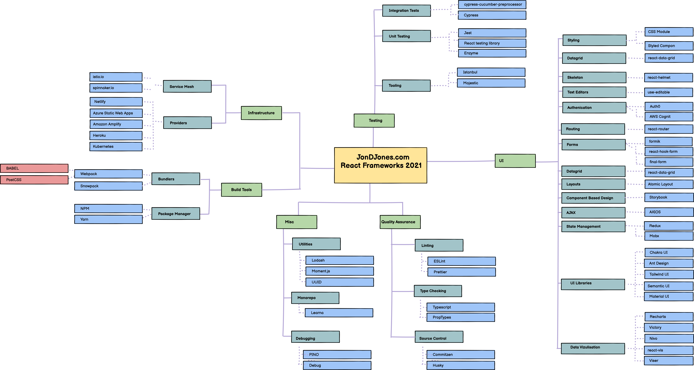
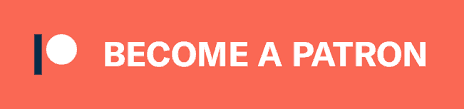

# #ILOVEReact :heart_eyes: - By JONDJONES.COM

\#ILOVEReact is a giant starter-kit for anyone wanting to learn React.js.  This repo contains a roadmap for everything you need to learn to master react, a list of tutorials to help you get started, and a number of real-world project ideas to give you a starting point to apply your skills

:star: **Don't forget to star this app as it's updated frequently** :star:

This is an open-source repo.  If you would like to add something or correct a mistake, please open a PR.

# :rocket: Roadmap 2021 :rocket:

This React 2021 road-map explains everything you need to master in order to become a react.js expert.  A links of all the packages can be found in the resources page.

## Getting Started Resources

- [Huge List Of React Resources](./RESOURCES.md)
- [Web-pack StaterKit](./good-practice/webpack-boilerplate)

## Project Ideas

- [Album Listing](./projects/AlbumListing)
- [DisplayATable](./projects/DisplayATable)
- [Hacker News](./projects/HackerNews)
- [LoginForm](./projects/LoginForm)
- [Monster Wars](./projects/MonsterAttack)
- [NodeAPIWithJSON](./projects/NodeAPIWithJSON)
- [Portfolio Website](./apps/Portfolio-Website)
- [Starwars Top Trumps](./projects/StarwarsTopTrumps/)
- [Todo App](./apps/todo-app)

# Contributing

:construction: Open an [issue](https://github.com/jondjones/ILoveReact/issues) or a [pull request](https://github.com/jondjones/ILoveReact) to suggest changes or additions.  :construction:

If you like the content you find here, and want to support more content like it and you'd like to contribute financially towards the effort (or any of my other, I do have a patreon that I would always appreciate your generosity towards.

# Authors

[Jon D Jones](http://www.jondjones.com)

# License

This work is licensed under a [Creative Commons Attribution-NonCommercial 4.0 International License](http://creativecommons.org/licenses/by-nc/4.0/)
