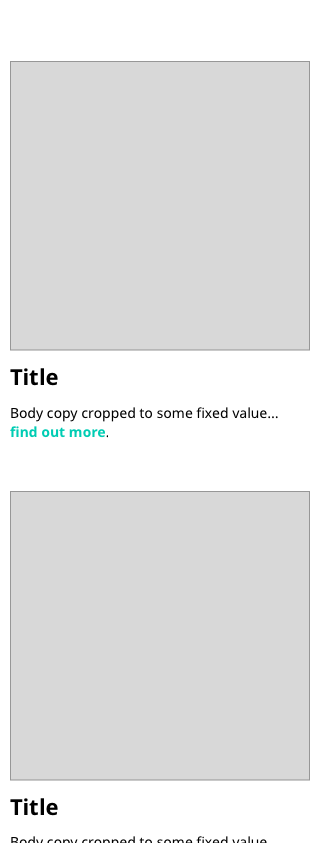

# Brief

*As a user I would like to be able to see a list of conditions, so I can investigate potential illness.*

Use the framework provided to produce a single page web application that can load and display the contents of the supplied JSON file.

## Backend Application

*As a client application I would like to be able to get conditions data via below endpoint.

http://localhost:5000/api/conditions

Conditions Data : `data/conditions.json`

## Frontend Application

Display an the image, title and snippet as shown in the wireframes. It could be that not all fields exist for each condition, if so the design should handle this gracefully.

## Mobile

 

## Desktop

 

The design should be modular and responsive. A roughed out design that shows intent is better than a compromised pixel perfect design.

Please include a markdown file indicating any decisions / compromises you made during the build.

**Hopefully this should be quite simple, there will be a follow up task to complete in the in the face to face interview.**